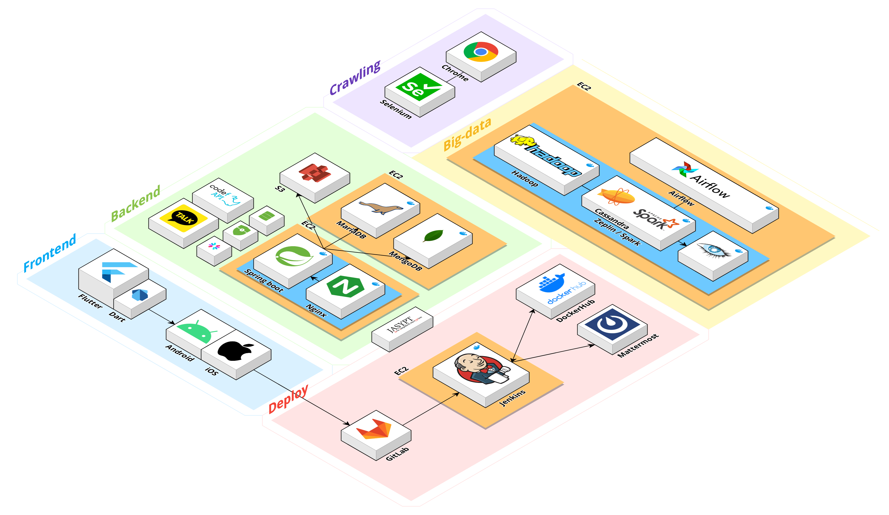
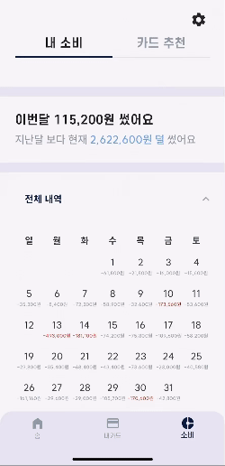
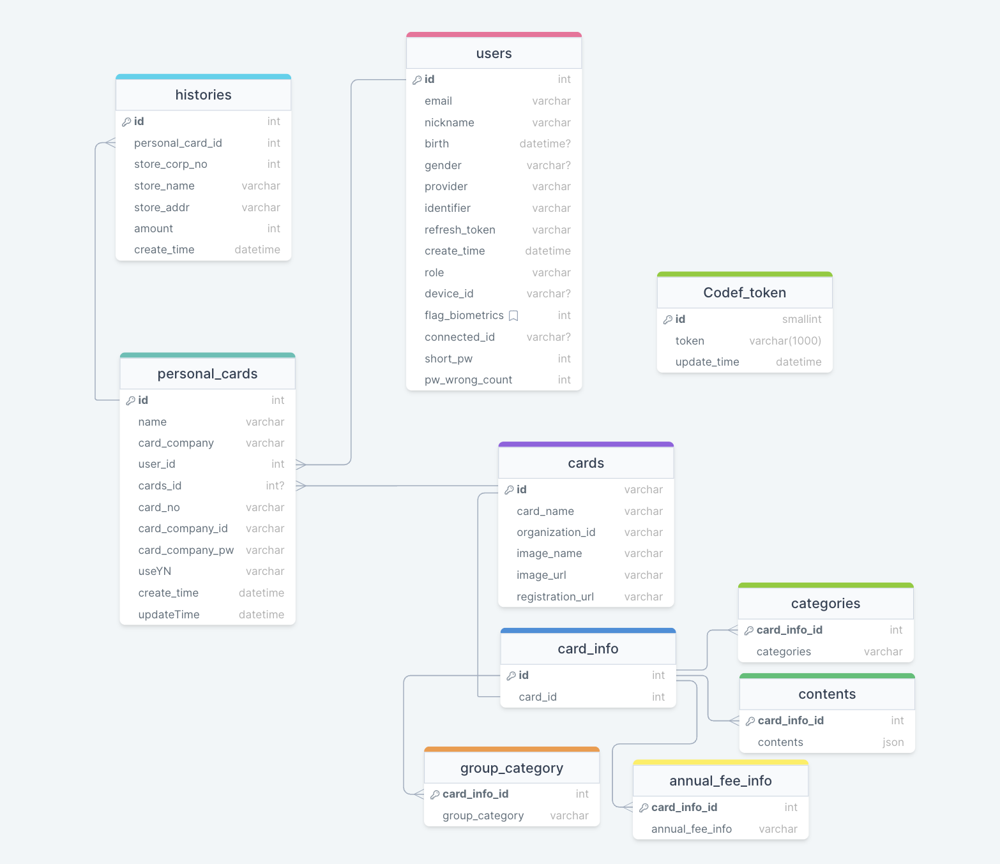
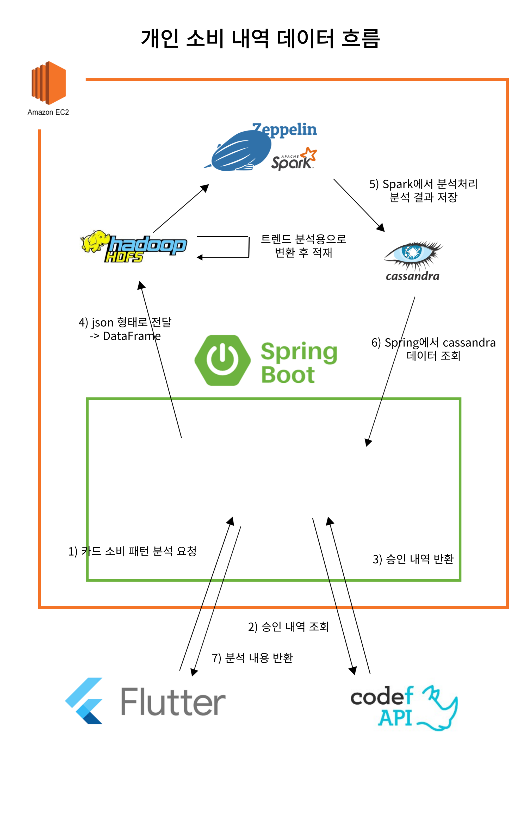

# 피카추 ⚡

<div align="center">
  <br />
  
  <br />
</div>

## 목차

- [서비스 개요](#서비스-개요)
- [팀원소개](#팀원소개)
- [기술스택](#기술스택)
- [시스템 아키텍처](#시스템-아키텍처)
- [기능소개](#기능소개)
- [프로젝트 산출물](#프로젝트-산출물)
- [컨벤션](#컨벤션)

## 서비스 개요

```
빅데이터 기반 소비 패턴 분석 및 카드 추천 서비스
피카추 ⚡⚡ (Personal 카드 추천)

📌 2024.02.19 ~ 2024.04.05 (7주)
```

## 팀원소개

<div align="middle">
<table>
    <tr>
        <td height="140px" align="center"> <a href="https://github.com/LeeChangon">
             <br><br> 👑 이창곤 <br>(Front-End) </a> <br></td>
        <td height="140px" align="center"> <a href="https://github.com/lhgeer7485">
             <br><br> 🥈 이해건 <br>(Front-End) </a> <br></td>
        <td height="140px" align="center"> <a href="https://github.com/seolyeonpark">
             <br><br> 🍻 박설연 <br>(Front-End) </a> <br></td>
        <td height="140px" align="center"> <a href="https://github.com/yi219">
             <br><br> 🐹 금예인 <br>(Back-End) </a> <br></td>
        <td height="140px" align="center"> <a href="https://github.com/Int-TRUE">
             <br><br> 🍔 정수진 <br>(Back-End) </a> <br></td>
        <td height="140px" align="center"> <a href="https://github.com/TutiTuti">
             <br><br> 🥩 최용수 <br>(Back-End) </a> <br></td>
    </tr>
</table>
</div>

## 기술스택

### 프론트엔드

<div align="middle">


**Language |** Dart 3.3.0

**Framework |** Flutter 3.19.0

**IDE |** Android Studio Hedgehog

**Library |** local_auth: ^2.2.0, provider: ^6.1.2, dio: ^5.4.1
, change_app_package_name: ^1.1.0, kakao_flutter_sdk: ^1.9.0, flutter_secure_storage: ^9.0.0, shared_preferences: ^2.2.2, flutter_dotenv: ^5.1.0, encrypt: ^5.0.3, crypto: ^3.0.3, flutter_native_splash: ^2.4.0, confetti: ^0.7.0, credit_card_scanner: ^1.0.5, webview_flutter: ^4.7.0, intl: ^0.19.0, pie_chart: ^5.4.0, table_calendar: ^3.1.1, rive: ^0.13.1, secure_application: ^4.0.0, flutter_launcher_icons: ^0.13.1, flutter_card_swiper: ^7.0.0,

<br>
<br>

</div>

### 백엔드

<div align="middle">

 


**Language |** Java 17.0.9

**Framework |** Spring Boot 3.2.3

**Data(RDBMS) |** Spring Data JPA

**Build Tool |** Gradle 8.4.0

**ETC |** Chrome: 122.0.6261.112, Chrome Driver: 122.0.6261.111 (크롤링)

</div>

<br>
<br>

### 분산

<div align="middle">

 
 
 

 
 


**Language |** Python 3.8

**Framework |** Apache Hadoop 3.2.4, Apache Spark 3.2.4, Apache Zookeeper 3.8.4, Zeppelin 0.10.1

**DB |** HDFS, Apache Cassandra 4.1.4

</div>

<br>
<br>

### 인프라

<div align="middle">


**DB |** MariaDB 10.11, MongoDB

**Server |** GitLab, Jenkins, Docker

</div>
<br>
<br>

## 시스템 아키텍처

<div align="middle">
  <br />
  
  <br />
</div>

## 기능소개

✨ 회원가입
<br>


<br>
<br>
✨ 로그인
<br>


- 카카오 소셜 로그인 (1차)
- 지문과 페이스 아이디를 통한 생체 로그인 (2차)

<br>
<br>

✨ 홈화면 - 혜택 별 카드 리스트
<br>


- 연령 별 소비 데이터를 통한 분석 결과 제공
- 개인 데이터를 이용하여 같은 집단과 비교 결과 제공
- 혜택 별로 살펴보는 인기 카드 리스트

<br>
<br>
✨ 내 카드 화면
<br>


- ocr을 통한 카드 등록
<br>


- 등록된 카드 이미지와 상세 정보
- 하루동안의 소비와 카드 혜택을 잘 이용하고 있는지 계산
<br>
<br>
✨ 소비패턴 화면
<br>


- 등록한 카드를 바탕으로 소비 패턴 분석
- 한달 소비 내역 및 카테고리 분석
- 이전 달과 비교한 소비 결과

<br>
<br>
✨ 추천 카드 화면
<br>


- 분석한 소비패턴을 기반으로 카드 추천
- 가장 많이 사용한 혜택 내역 위주의 추천

<br>
<br>

## 프로젝트 산출물

- API 명세서

> https://www.notion.so/yi219/API-5df77923d2d04ae5ae141e36410670be?pvs=4 > <br> > <br>

- ERD

<div align="middle">
  <br />
  
  <br />
</div>

<br>
<br>

- 와이어프레임

> https://www.figma.com/file/7OJJjBJYvG7yZHZMA2RcJ4/D110-%EC%A7%B1%EB%93%A4%EC%9D%98%EB%94%94%EC%9E%90%EC%9D%B8?type=design&node-id=143%3A533&mode=design&t=jmWbTaIamnQybbWO-1

<br>
<br>

- 분산 파이프라인
<div align="middle">
  <br />
  
  <br />
</div>

- 포팅매뉴얼

> [포팅매뉴얼](./exec/distributed_file_system_setting.md)

## 컨벤션

## Commit

- 💠 **feat**: 새로운 기능 추가
- 🛠 **fix**: 버그 수정
- 📜 **docs**: 문서 변경사항
- 🎀 **style**: 코드 포맷 변경, 세미콜론 누락 등 코드의 기능에 영향을 주지 않는 변경사항
- ✨ **refactor**: 코드 리팩토링
- 🍀 **test**: 테스트 코드, 리팩토링 테스트 코드 추가
- 💭 **chore**: 빌드 업무 수정, 패키지 매니저 설정 등의 변경사항

### 제목

- 50자를 넘지 않도록 합니다.
- 명령문 형태로 작성합니다.
- 대문자로 시작합니다.
- 마지막에 마침표(.)를 사용하지 않습니다.
- Jira 이슈 번호를 ()안에 적습니다.(선택적)

### 본문 (선택적)

- 적절히 줄바꿈을 합니다.
- 어떻게보다는 무엇을, 왜 변경했는지를 설명합니다.

### 꼬리말 (선택적)

- Jira 이슈 번호를 적습니다.

**예시**

```
feat: 사용자 로그인 기능 추가 (S10P12D109-4)

로그인 API 연동과 사용자 인증 로직을 구현했습니다.
사용자는 이메일과 비밀번호를 통해 로그인할 수 있습니다.

Jira 이슈 번호: S10P12D109-4
```

```
fix: 장바구니 항목 삭제 버그 수정 (S10P12D109-3)

장바구니에서 항목을 삭제할 때 발생하는 오류를 수정했습니다.
항목 삭제 후 장바구니 업데이트 로직이 제대로 동작하지 않는 문제가 있었습니다.

Jira 이슈 번호: S10P12D109-3
```


MergeRequest의 진행 상황에 따라 라벨(대기, 거절, 승인)을 이용합니다.

## Branch

1. **main 브랜치**: 안정적인 버전의 코드가 저장되는 브랜치로, 프로덕션 준비가 완료된 코드만이 master에 병합됩니다. 일반적으로 배포 가능한 상태만을 유지합니다.
2. **develop 브랜치**: 개발을 위한 주요 브랜치로, 기능 개발 브랜치들이 병합되는 곳입니다. 개발의 최신 상태를 반영하며, 다음 릴리즈를 준비하는 코드가 모여 있습니다.
3. **feature 브랜치들**: 새로운 기능 개발이나 버그 수정을 위해 develop 브랜치로부터 분기된 브랜치입니다. 개발이 완료되면 다시 develop 브랜치로 병합됩니다.

### 예시

- main
  - be/dev
    - be/feat/log-in
  - fe/dev
    - fe/feat/main-page
